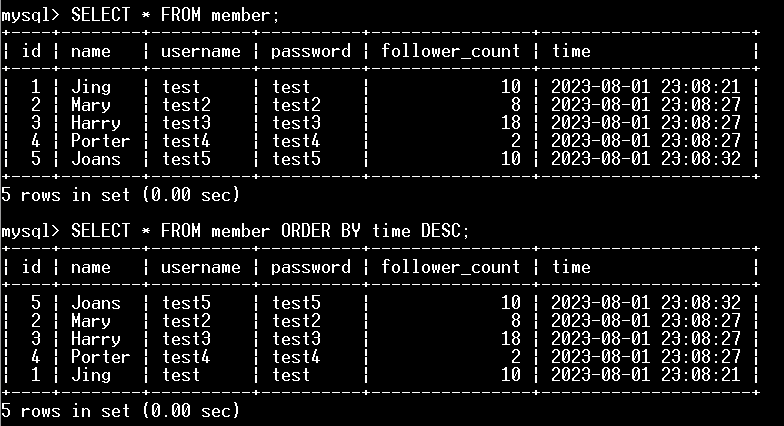

# Week 5 Assignment

## 要求三：SQL CRUD

```sql =
-- INSERT
INSERT INTO member (name, username, password, follower_count)
VALUES ('Jing', 'test', 'test', 10);
INSERT INTO member (name, username, password, follower_count)
VALUES ('Mary', 'test2', 'test2', 8);
INSERT INTO member (name, username, password, follower_count)
VALUES ('Harry', 'test3', 'test3', 18);
INSERT INTO member (name, username, password, follower_count)
VALUES ('Porter', 'test4', 'test4', 2);
INSERT INTO member (name, username, password, follower_count)
VALUES ('Joans', 'test5', 'test5', 10);

-- SELECT
SELECT * FROM member;

SELECT * FROM member ORDER BY time DESC;

SELECT * FROM member ORDER BY time DESC LIMIT 1, 3;

SELECT * FROM member
WHERE username = 'test';

SELECT * FROM member
WHERE username = 'test' AND password = 'test';

-- UPDATE
UPDATE member
SET name = 'test2'
WHERE username = 'test';
```

**執行畫面**

1. INSERT
   
   
3. SELECT
   
   
   
5. UPDATE
   

## 要求四：SQL Aggregate Functions

```sql =
-- AGGREGATE
SELECT COUNT(*) FROM member;

SELECT SUM(follower_count) FROM member;

SELECT AVG(follower_count) FROM member;
```

**執行畫面**


## 要求五：SQL JOIN

```sql =
-- CREATE TABLE
CREATE TABLE message (
    id BIGINT AUTO_INCREMENT COMMENT '獨立編號',
    member_id BIGINT COMMENT '留言者會員編號',
    content VARCHAR(255) NOT NULL COMMENT '留言內容',
    like_count INT UNSIGNED NOT NULL DEFAULT 0 COMMENT '按讚的數量',
    time DATETIME NOT NULL DEFAULT NOW() COMMENT '留言時間',
    PRIMARY KEY (id),
    FOREIGN KEY (member_id) REFERENCES member(id)
);

-- INSERT TESTING DATA
INSERT INTO message (member_id, content, like_count)
VALUES ('1', 'hello2', 2);
INSERT INTO message (member_id, content, like_count)
VALUES ('1', 'hello4', 4);
INSERT INTO message (member_id, content, like_count)
VALUES ('1', 'hello88', 8);
INSERT INTO message (member_id, content, like_count)
VALUES ('3', 'world3', 33);
INSERT INTO message (member_id, content, like_count)
VALUES ('4', 'world4', 16);

-- JOIN
SELECT member.name, msg.*
FROM message msg
LEFT JOIN member ON msg.member_id = member.id;

SELECT member.name,member.username, msg.*
FROM message msg
LEFT JOIN member ON msg.member_id = member.id
WHERE member.username = 'test';

SELECT member.name, AVG(msg.like_count)
FROM message msg
LEFT JOIN member ON msg.member_id = member.id
WHERE member.username = 'test'
GROUP BY member.name;
```

**執行畫面**

1. CREATE TABLE: also add some testing data
   
   
   
3. JOIN
   
